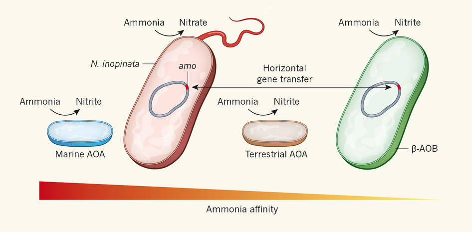

# Title

> Give your latest & greatest perspective piece an informative title that makes it clear what your perspective piece is about but is not quite as boring as most journal article titles. For example: `A fight for scraps of ammonia` is the title of a [recent Nature News&Views perspective](http://www.nature.com/nature/journal/v549/n7671/full/549162a.html) about the article `Kinetic analysis of a complete nitrifier reveals an oligotrophic lifestyle`.

#### Article: [Citation](www.???.com/pathtoarticle)

> Provide the citation (authors, title, journal and year) and web address of the article your perspective piece is about in the form of a link: `[Citation](www.???.com/articleaddress)`. Example: [Kits et al. Kinetic analysis of a complete nitrifier reveals an oligotrophic lifestyle. Nature, 2017](http://www.nature.com/nature/journal/v549/n7671/full/nature23679.html). If it is an older journal article that may not have a direct web address, please add the PDF of the article to your repository and link to the file instead of a webpage (i.e. use `[Citation](pathtoarticle.pdf)` instead, just like with images).

#### Summary

> Provide a one sentence summary

## Perspective

> Add the main text of your perspective.

*Figure 1: Caption*

#### Word Count:

> Check your word count. The maximum is 1000 words excluding references.

## References

> Remove all the instructions (lines beginning with ">") from the file to clean-up your assignment.
