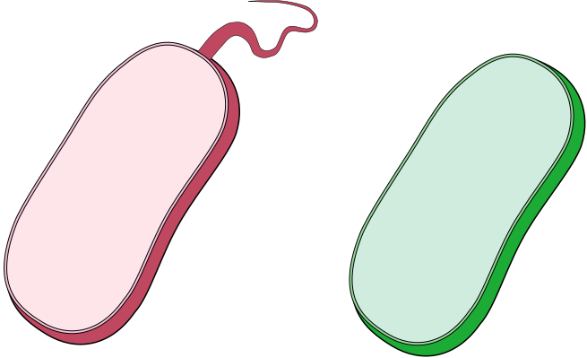

# Title

> Give your latest & greatest perspective piece an informative title that makes it clear what your perspective piece is about but is not quite as boring as most journal article titles. For example: `A fight for scraps of ammonia` is the title of a [recent Nature News&Views perspective](http://www.nature.com/nature/journal/v549/n7671/full/549162a.html) about the article `Kinetic analysis of a complete nitrifier reveals an oligotrophic lifestyle`.

#### Article: [Citation](www.???.com/pathtoarticle)

> Provide the citation (authors, title, journal and year) and web address of the article your perspective piece is about in the form of a link: `[Citation](www.???.com/articleaddress)`. Example: [Kits et al. Kinetic analysis of a complete nitrifier reveals an oligotrophic lifestyle. Nature, 2017](http://www.nature.com/nature/journal/v549/n7671/full/nature23679.html). If it is an older journal article that may not have a direct web address, please add the PDF of the article to your repository and link to the file instead of a webpage (i.e. use `[Citation](pathtoarticle.pdf)` instead, just like with images).

#### Summary

> Provide a one or two sentence summary of your perspective. This is sometimes easier to write at the very end after finishing the main text itself.

## Perspective

> Add the main text of your perspective. This should include a little bit of background to contextualize the study you are writing about, followed by your explanation of the most interesting aspects of the article (e.g. - problem, data, methods, results, interpretation), and finishing with your take on what that might mean for future research (or how it influenced the research that followed in case of a classic paper). Make sure to place your figure where it fits best and feel free to use subheadings (`### Subheading` or `#### Sub-subheading`) and other markdown styling (e.g. `*italics*` and `**bold**`) to structure your text as you see fit.

> To include references, use the syntax `[Kits et al. (2017)][@kits2017]` which looks like this [Kits et al. (2017)][@kits2017] ref [hello][1]

*Figure 1: Example Caption*

> Include one original color figure+caption that helps explain the aspects of the study you discuss in this perspective. If you have a preferred graphics program that you are already familiar with, feel free to use it for this figure. If you don't already have one, I recommend using the very well-designed free web-based vector graphics program [Gravit Designer](https://designer.gravit.io/) (you can use it without creating an account but if you create one, you can store your designs in the cloud). The example figure above was created using Gravit Designer based on the example News&Views (the .gvdesign file is in the figures folder in case you want to load it into Gravit Designer as an example).

> For eventual inclusion in this document, make sure that you save your figure in `.svg`, `.png` or `.jpeg/.jpg` format in the `figures` folder. If your graphics program supports it, `.svg` is better than `.png` or `.jpeg/.jpg` because it is a high quality scalable vector graphics format. In [Gravit Designer](https://designer.gravit.io/), you can do this for example via `File -> Export -> Scalable Vector Graphics (.svg)`.

Some text in which I cite an author.[^fn1]

More text. Another citation.[^fn2]

What is this? Yet *another* citation?[^fn3]

[^fn1]: So Chris Krycho, "Not Exactly a Millennium," chriskrycho.com, July 22,
    2015, http://www.chriskrycho.com/2015/not-exactly-a-millennium.html
    (accessed July 25, 2015), ¶6.

[^fn2]: Contra Krycho, ¶15, who has everything *quite* wrong.

#### Word Count:

> Check your word count. The maximum is 1000 words excluding references.

## References

[You can use numbers for reference-style link definitions][2]

  1. [2kits]: Reference "Title"
  2. [1]: "All there is"
  3. [2]: http://www.reddit.com
  4. [^fn3]: ibid.

> List your references. You should have more than 4 but less than 12 references.

> Remove all the instructions (lines beginning with ">") from the file to clean-up your assignment.
