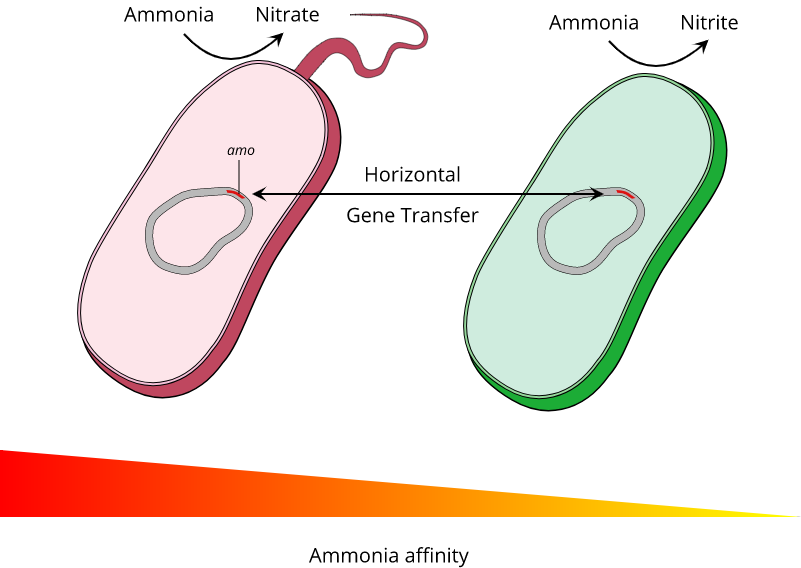

# Title

> Give your latest & greatest perspective piece an informative title that makes it clear what your perspective piece is about but is not quite as boring as most journal article titles. For example: **A fight for scraps of ammonia** is the title of a [recent Nature News&Views perspective](http://www.nature.com/nature/journal/v549/n7671/full/549162a.html) about the article **Kinetic analysis of a complete nitrifier reveals an oligotrophic lifestyle**.

#### Article: [Citation](www.???.com/pathtoarticle)

> Provide the citation (authors, title, journal and year) and web address of the article your perspective piece is about in the form of a link: `[Citation](www.???.com/articleaddress)`. Example: [Kits et al. Kinetic analysis of a complete nitrifier reveals an oligotrophic lifestyle. Nature, 2017](http://www.nature.com/nature/journal/v549/n7671/full/nature23679.html). If it is an older journal article that may not have a direct web address, please add the PDF of the article to your repository and link to the file instead of a webpage (i.e. use `[Citation](repository path to article.pdf)` instead).

#### Summary

> Provide a one or two sentence summary of your perspective. This is sometimes easier to write at the very end after finishing the main text itself.

## Perspective

> Add the main text of your perspective. This should include a) a little bit of background to contextualize the study you are writing about, followed by b) your explanation of the most interesting aspects of the article (e.g. - problem, data, methods, results, interpretation), and c) finishing with your perspective on what that might mean for future research (or how it influenced the research that followed in case of an older classic paper). Make sure to place your figure where it fits best and feel free to use subheadings (`### Subheading` or `#### Sub-subheading`) and other markdown styling (e.g. `*italics*` and `**bold**`) to structure your text as you see fit. Also make sure to point to the appropriate references using the author, year reference style (and include all references at the end of the document). For example:

Ammonia oxidizing Archaea can grow on almost undetectable amounts of ammonia (Kits et al., 2017).

*Figure 1: Example Caption*

> Include one original color figure+caption that helps explain the aspects of the study you discuss in this perspective. If you have a preferred graphics program that you are already familiar with, feel free to use it for this figure. If you don't already have one, I recommend using the very well-designed free web-based vector graphics program [Gravit Designer](https://designer.gravit.io/) (you can use it without creating an account but if you create one, you can store your designs in the cloud). The example figure above was created using Gravit Designer based on the example News&Views (the .gvdesign file is in the figures folder in case you want to load it into Gravit Designer as an example).

> For direct display in this document, make sure that you save your figure in **.png** or **.jpeg/.jpg** format in the **figures** folder. In [Gravit Designer](https://designer.gravit.io/), you can get a PNG, for example, via `File -> Export -> PNG Image (.png)`.

#### Word Count:

> Check your word count. The maximum is 1000 words excluding references.

## References

> List all your references in **alphabetical** order (by the last name of the first author). You should have more than 4 but less than 12 references. All references should link to the journal's online version of the referenced article (unless the article is so old it isn't available online) and the reference text needs to include at a minimum: author last name(s), title, journal and year. The exact reference style and formatting is up to you. However, you have to be consistent, all references should be formatted the same way. Make sure that all your references are mentioned at least once in the main text and include both author and year when referencing.

> For example, you could use a reference style as simple as *Author(s). Article title. Journal title, Year.* (with et al. if more than 3 authors) as illustrated below:

1. [Francis et al. Ubiquity and diversity of ammonia-oxidizing archaea in water columns and sediments of the ocean. PNAS, 2005.](http://www.pnas.org/content/102/41/14683)
1. [Kits et al. Kinetic analysis of a complete nitrifier reveals an oligotrophic lifestyle. Nature, 2017.](http://www.nature.com/nature/journal/v549/n7671/full/nature23679.html)
1. [Schleper. Ammonia oxidation: different niches for bacteria and archaea. ISME Journal, 2010.](https://www.nature.com/ismej/journal/v4/n9/full/ismej2010111a.html)

> Remove all the instructions (lines beginning with ">") from the file to clean-up your assignment.
